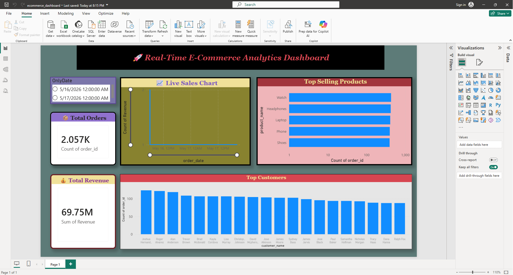

# 🚀 Real-Time E-Commerce Analytics Dashboard

## 📌 Project Overview
This project is a Real-Time E-Commerce Analytics Dashboard built using Python, MySQL, SQL, and Power BI.

The system generates live e-commerce order data, stores it in a MySQL database, performs SQL analysis, and visualizes insights in Power BI dashboards.

---

## 🛠 Tech Stack
- Python
- MySQL
- SQL
- Power BI
- Faker Library

---

## 📊 Dashboard Features
- 💰 Total Revenue KPI
- 📦 Total Orders KPI
- 📈 Live Sales Trend
- 🛍 Top Selling Products
- 👥 Top Customers Analysis
- 📅 Interactive Date Slicer

---

## ⚙️ Project Workflow

Python Live Data Generator
↓
MySQL Database
↓
SQL Analytics
↓
Power BI Dashboard

---

## 📂 Project Structure

real_time_sales_project/
│
├── python/
│ └── live_orders.py
│
├── sql/
│ └── analytics_queries.sql
│
├── dashboard/
│ └── ecommerce_dashboard.pbix
│
├── screenshots/
│
└── README.md

---

## 🔥 Key Learnings
- Database connections
- SQL joins and aggregations
- Power BI relationships
- DAX calculations
- Dashboard design
- Real-time analytics workflow

---

## 📸 Dashboard Preview

---

## 🚀 Future Improvements
- Auto refresh
- Advanced KPIs
- More filters/slicers
- Cloud deployment
